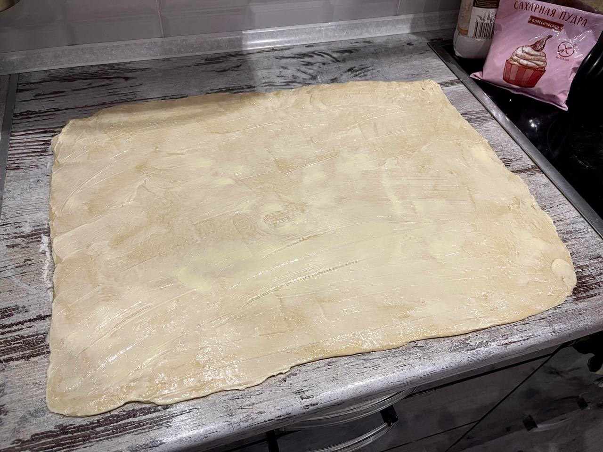

La pâte levée revient sur scène ! Et aujourd’hui, nous allons préparer des cinnabons. C’est encore une recette avec une petite étoile côté temps — c’est toujours le cas avec la pâte levée. Mais croyez-moi, vous ne regretterez pas une seule minute une fois que vous aurez croqué dans cette douce brioche. J’ai cherché pendant des années la recette parfaite, et je l’ai trouvée chez Liza Glinskaïa. Il me semble important de la mentionner, car je n’ai rien changé à sa recette.

### Ingrédients :
```
☑️ Farine – 650 g
☑️ Sucre – 230 g
☑️ Lait – 350 ml
☑️ Œufs – 2
☑️ Levure sèche – 5 g
☑️ Sel – 4 g
☑️ Beurre – 200 g
☑️ Cannelle – 20 g
☑️ Fromage frais type Philadelphia – 250 g
☑️ Sucre glace – 50 g
```

### Préparation :
#### 1. Préparer le levain (ou pré-ferment) :
Tamiser 150 g de farine et les mélanger avec la levure. Chauffer 300 ml de lait au micro-ondes à 30–35 °C.
Verser le lait tiède dans un saladier, ajouter 20 g de sucre, puis incorporer le mélange farine/levure. Bien mélanger pour obtenir une pâte lisse, sans grumeaux.
Couvrir avec un torchon et laisser reposer dans un endroit chaud pendant 40–50 minutes.
<figure markdown>

</figure>
Sortir à ce moment-là 100 g de beurre pour qu’il ramollisse.

#### 2. La pâte :
Une fois le levain prêt, battre les œufs avec le sel et 60 g de sucre. 
<figure markdown>

</figure>
Ajouter le levain et bien mélanger — la pâte va diminuer de volume, c’est normal.
Ajouter ensuite le beurre ramolli, puis le reste de la farine.
<figure markdown>

</figure>
Mélanger d’abord avec une spatule, 
<figure markdown>

</figure>
puis pétrir à la main pendant environ 10 minutes jusqu’à obtenir une pâte souple.
<figure markdown>

</figure>
Former une boule, la placer dans un saladier, couvrir d’un torchon et laisser lever dans un endroit chaud pendant 1h à 1h30.
<figure markdown>

</figure>
Sortir les 100 g de beurre restants pour qu’ils ramollissent.

#### 3. Façonnage :
Une fois la pâte levée, 
<figure markdown>

</figure>
fariner légèrement le plan de travail, puis étaler la pâte en un rectangle d’environ 40 x 60 cm.

<figure markdown>

</figure>
Étaler uniformément le beurre ramolli sur toute la surface.
<figure markdown>

</figure>
Mélanger 150 g de sucre avec 20 g de cannelle, et saupoudrer ce mélange sur le beurre.
<figure markdown>

</figure>

#### 4. Façonner les rouleaux :
Rouler la pâte sur elle-même, dans le sens de la longueur.
<figure markdown>


</figure>
Découper ensuite le rouleau en 12 parts égales d’environ 5 cm de large.
<figure markdown>


</figure>
Utiliser du fil ou de la ficelle alimentaire : passer sous le rouleau à l’endroit désiré et tirer les extrémités pour couper proprement (comme montré dans la vidéo).

#### 5. Deuxième pousse :
Disposer les roulés sur une plaque recouverte de papier cuisson, en les espaçant légèrement.
<figure markdown>

</figure>
Replier l’extrémité de chaque roulé pour éviter qu’il ne se déroule à la cuisson.
Couvrir d’un torchon et laisser pousser encore 50 minutes dans un endroit chaud.
<figure markdown>

</figure>
Préchauffer le four à 180°C.

#### 6. Cuisson :
Enfourner les cinnabons pour 20 à 25 minutes, jusqu’à ce qu’ils soient dorés.

<figure markdown>

</figure>

#### 7. Le glaçage :
Pendant la cuisson, préparer le glaçage :
Mélanger le fromage frais, le sucre glace et 50 ml de lait. Fouetter vigoureusement jusqu’à obtenir une crème lisse.

#### 8. Finition :
Dès la sortie du four, verser le glaçage sur les cinnabons encore chauds.
<figure markdown>

</figure>