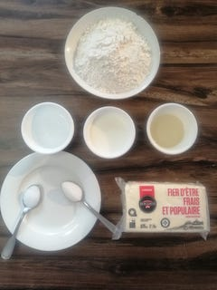
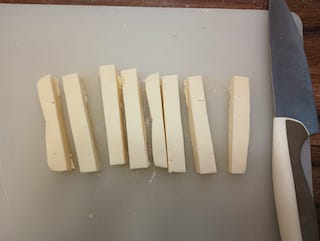
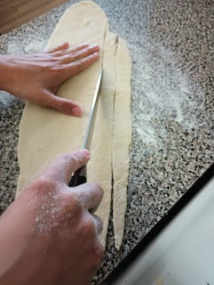
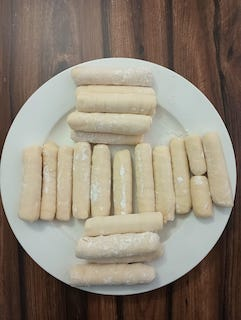
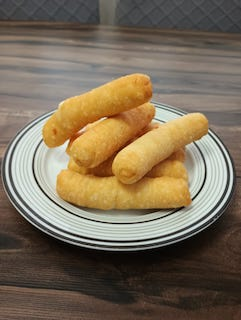

### Ingrédients

```
320 g (2 ½ tasses) de farine tout usage
120 ml de lait
120 ml d'eau
40 ml d’huile de maïs
Une cuillère à café de sel de table
Une cuillère à café de sucre (si vous voulez, ajoutez une seconde cuillère)
200 g du fromage frais.
```
<figure markdown>


</figure>

### Étapes de préparation


* Dans un bol, placer la farine tout usage. Dans une casserole, mettre tous les ingrédients restants, mélanger avec une cuillère et les chauffer un petit peu (vous devriez y mettre un doigt sans se bruler).
* Après ajouter ce mélange-là à la farine et avec l’aide d’une spatule ou une cuillère à bois intégrer tout, tout de suite utilisez les mains pour pétrir la pâte pendant 3-4 minutes en obtenant une pâte parfaite. Vous pourriez avoir besoin d’ajouter plus de farine pour améliorer la contexture de la pâte.
* Lorsque la pâte repose quelques minutes, couper le fromage en bâtons de 1 cm x 1cm x 6 cm ou de la longueur souhaitée, la longueur de ceux-ci sera la même des doigts aux fromages. Utilisez un rouleau à pâtisserie pour
étirer la pâte, après en utilisant un couteau couper la pâte et faire des bandes d’environ 1,5 cm de large.

<figure markdown>

</figure>
<figure markdown>

</figure>
* Prenez un bâton du fromage et roulez une bande de la pâte en recouvrant complètement le fromage. Pour sceller la pâte, passez les doits aux fromages sur la table (voir la vidéo). Faire frire en abondante huile végétale,
tournez-les pour assurer une cuisson complète indiquée par la couleur dorée.

<figure markdown>

</figure>
* Voilà ! Bon appétit ! Servez-en-vous avec une sauce ou un ‘dip’ de votre préférence.

<figure markdown>

</figure>
!!! tip
    Vous pouvez congeler les doigts aux fromages pour les manger un autre jour, dans ce cas, vous devrez les mettre de cette manière dans l’huile pour les faire frire.


### Collation vénézuélienne

(Au Venezuela, on les appelle ‘tequeños’, en référence à la ville de 'Los Teques' où ils sont originaires)

