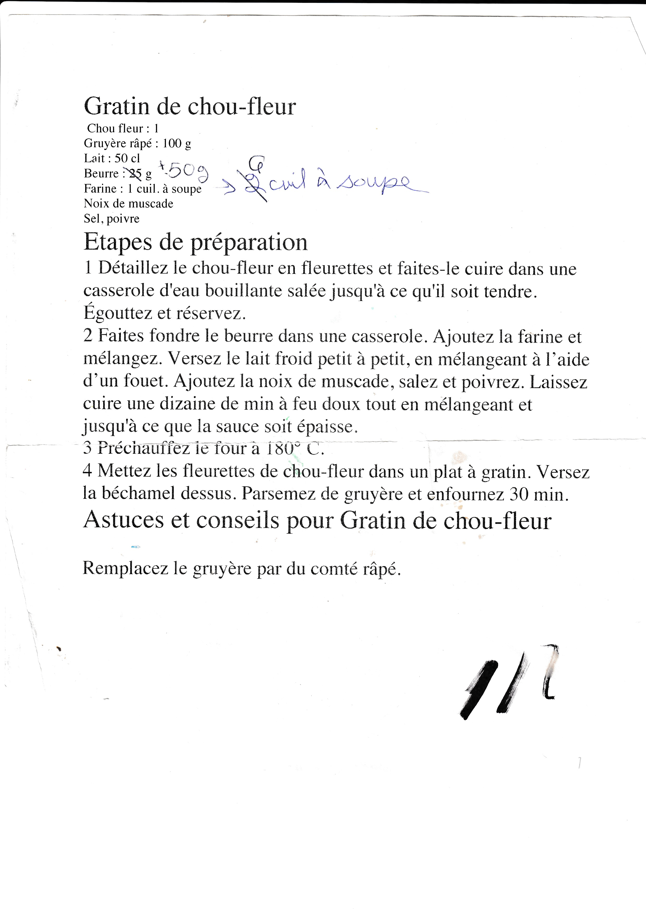

## GRATIN DE CHOU-FLEUR

### Ingredients

```
Chou fleur : 1
Gruyère râpé : 100 g
Lait: 500 mL
Beurre : 50 g
Farine : 6 cuil. à soupe
Noix de muscade
Sel, poivre
```

### Etapes de préparation
* Détaillez le chou-fleur en fleurettes et faites-le cuire dans une
casserole d'eau bouillante salée jusqu'à ce qu'il soit tendre.
Égouttez et réservez.

* Faites fondre le beurre dans une casserole. Ajoutez la farine et
mélangez. Versez le lait froid petit à petit, en mélangeant à l’aide
d’un fouet. Ajoutez la noix de muscade, salez et poivrez. Laissez
cuire une dizaine de minutes à feu doux tout en mélangeant et
jusqu'à ce que la sauce soit épaisse.

* Préchauffez le four a 180°C.

* Mettez les fleurettes de chou-fleur dans un plat à gratin. Versez
la béchamel dessus. Parsemez de gruyère et enfournez 30 min.

### Astuces et conseils pour Gratin de chou-fleur

Remplacez le gruyère par du comté râpé.

### Image



<!--- 2 plats --->

## POULET AUX OLIVES

### Ingredients

```
4 poitrines de poulet désossées (8 suprêmes)
2 ou 3 gousses d’ail
1/2 tasse de vinaigre de vin blanc
1/2 tasse d’huile d’olive
1/2 tasse d’olives vertes ou noires (melange)
1/2 tasse de pruneaux coupés en deux
1/4 tasse de câpres
1/2 tasse de vin blanc
1/2 tasse de cassonade (beaucoup trop)
sel, poivre, origan
```

### Etapes de préparation
* Mélanger les ingrédients, sauf le vin, et laissez mariner au minimum 1 heure.

* Ajoutez la 1/2 tasse de vin blanc et la 1/2 tasse de cassonade avant de mettre au
four. N.B. Les pruneaux apportent juste ce qu'il faut de sucre. La cassonade est en
trop si l’on ne désire pas un plat sucré.

* Mettez au four à 350 F pendant 45 minutes. Vérifiez la cuisson après 30 minutes.
Servez avec du riz au safran.

*  `Vin blanc (Sancerre par exemple).
Amélie Fradet, mars 1998.`


### Image

