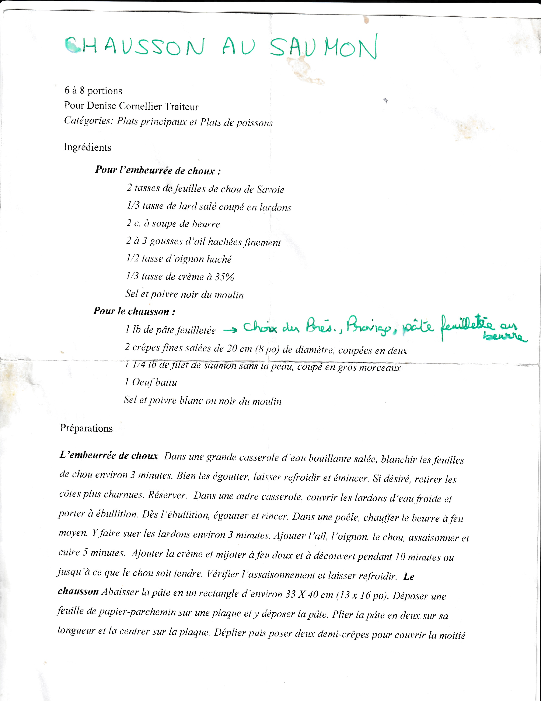
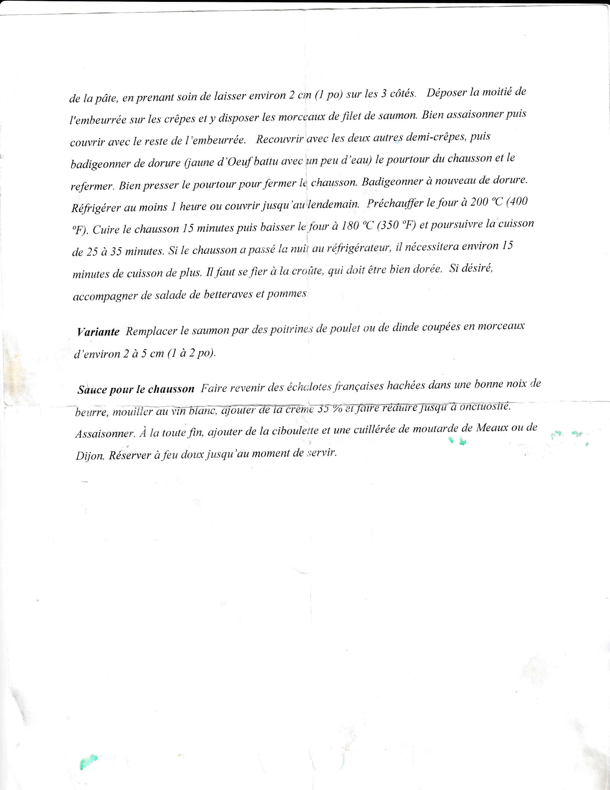

### Ingrédients

```
Pour l’embeurrée de choux :
2 tasses de feuilles de chou de Savoie
1/3 tasse de lard salé coupé en lardons
2 c. à soupe de beurre
2 à 3 gousses d'ail hachées finement
1/2 tasse d'oignon haché
1/3 tasse de crème à 35%
Sel et poivre noir du moulin

Pour le chausson :
1 lb de pâte feuilletée "Tender Flake"
2 crêpes fines salées de 20 cm (8 po) de diamètre,
 coupées en deux (crêpes bretonnes)
1 1/4 lb de filet de saumon sans la peau, coupé en gros morceaux
1 Oeuf battu
Sel et poivre blanc ou noir du moulin
```

### Étapes de préparation
__L’embeurrée de choux__

* Dans une grande casserole d’eau bouillante salée, blanchir les feuilles
de chou environ 3 minutes. Bien les égoutter, laisser refroidir et émincer. Si désiré, retirer les côtes plus charnues. Réserver.

* Dans une autre casserole, couvrir les lardons d ‘eau froide et porter à ébullition. Dès l’ébullition, égoutter et rincer. 

* Dans une poêle, chauffer le beurre à feu moyen. Y faire suer les lardons environ 3 minutes. Ajouter l’ail, l’oignon, le chou, assaisonner et
cuire 5 minutes.

* Ajouter la crème et mijoter à feu doux et à découvert pendant 10 minutes ou
Jusqu'à ce que le chou soit tendre. Vérifier l'assaisonnement et laisser refroidir.

**Le chausson**

* Abaisser la pâte en un rectangle d’environ 33 X 40 cm (13 x 16 po). Déposer une feuille de papier-parchemin sur une plaque et y déposer la pâte. Plier la pâte en deux sur sa longueur et la centrer sur la plaque. Déplier puis poser deux demi-crêpes pour couvrir la moitié de la pâte, en prenant soin de laisser environ 2 cm (1 po) sur les 3 cotés.

* Déposer la moitié de l'embeurrée sur les crêpes et y disposer les morceaux de filet de saumon. Bien assaisonner puis couvrir avec le reste de l'embeurrée.

* Recouvrir avec les deux autres demi-crêpes, mpuis badigeonner de dorure (jaune d'oeuf battu avec un peu d'eau) le pourtour du chausson et le refermer. Bien presser le pourtour pour fermer le chausson. Badigeonner à nouveau de dorure. Réfrigérer au moins 1 heure ou couvrir jusqu'au lendemain.

* Préchauffer le four à 200C (400 F). Cuire le chausson 15 minutes puis baisser le four à 180 C (350 F) et poursuivre la cuisson de 25 à 35 minutes. Si le chausson a passé la nuit au réfrigérateur, il nécessitera environ 15 minutes de cuisson de plus. Il faut se fier à la croûte, qui doit être bien dorée.

* Si désiré, accompagner de salade de betteraves et pommes.

__Variante__

Remplacer le saumon par des poitrines de poulet ou de dinde coupée en morceaux d'environ 2 à 5 cm (1 à 2 po).

### Sauce pour le chausson

Faire revenir des échalotes francaises hachées dans une bonne noix de beurre, mouiller au vin blanc, ajouter de la crème 35 % et faire réduire jusqu'à onctuosité. Assaisonner. À la toute fin, ajouter de la ciboulette et une cuillère de moutarde de Meaux ou de Dijon. Réserver à feu doux jusqu'u moment de servir.


### Image


