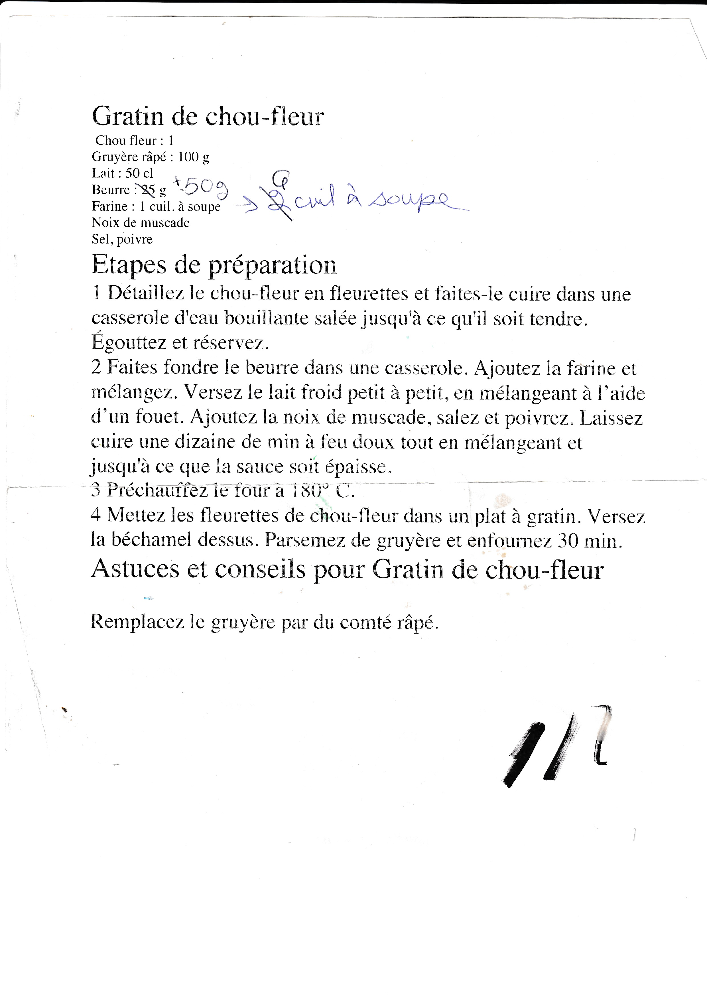

### Ingrédients

```
1 chou fleur
100 g de gruyère râpé : 
500 mL de lait
50 g de beurre
6 cuil. à soupe de farine
Noix de muscade
Sel, poivre
```

### Étapes de préparation
* Détaillez le chou-fleur en fleurettes et faites-le cuire dans une
casserole d'eau bouillante salée jusqu'à ce qu'il soit tendre.
Égouttez et réservez.

* Faites fondre le beurre dans une casserole. Ajoutez la farine et
mélangez. Versez le lait froid petit à petit, en mélangeant à l’aide
d’un fouet. Ajoutez la noix de muscade, salez et poivrez. Laissez
cuire une dizaine de minutes à feu doux tout en mélangeant et
jusqu'à ce que la sauce soit épaisse.

* Préchauffez le four a 180°C.

* Mettez les fleurettes de chou-fleur dans un plat à gratin. Versez
la béchamel dessus. Parsemez de gruyère et enfournez 30 min.

### Astuces et conseils pour Gratin de chou-fleur

Remplacez le gruyère par du comté râpé.

### Image


