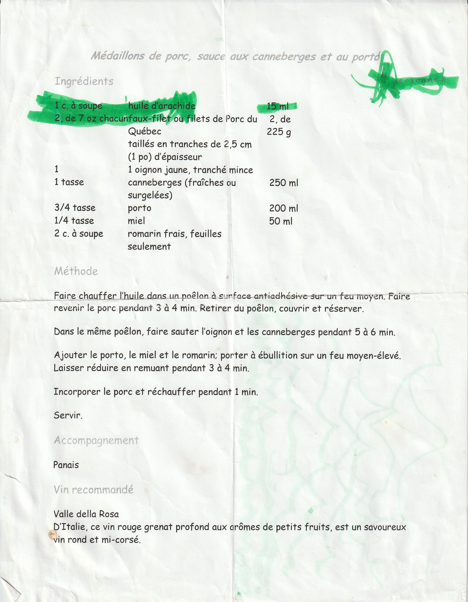

### Ingrédients

```
225 g de filet de porc taillés en tranches de 2,5 cm (1 po) d'épasseur
1 oignon jaune, tranché mince
1 tasse (250 mL) de anneberges (fraîches ou surgelées)
3/4 tasse (200 ml) de porto
1/4 tasse (50 ml) de miel
1 cuil. à soupe de l'huile d'arachide
2 cuil. à soupe de romarin frais, feuilles seulement
```

### Étapes de préparation
* Faire chauffer l'huile dans un poêlon à surface antiadhésive sur un feu moyen. Faire revenir le porc pendant 3 à 4 min. Retirer du poêlon, couvrir et réserver.

* Dans le même poêlon, faire sauter l'oignon et les canneberges pendant 5 à 6 min.

* Ajouter le porto, le miel et le romarin: porter à ébullition sur un feu moyen-élevé. Laisser réduire en remuant pendant 3 à 4 min.

* Incorporer le porc et réchauffer pendant 1 min.

* Servir

### Accompagnement
Panais

### Vin reccomandé
Valle della Rosa
D'Italie, ce vin rouge grenat profond aux arômes de petits fruits, est un savoureux vin rond et mi-corsé.

### Image

