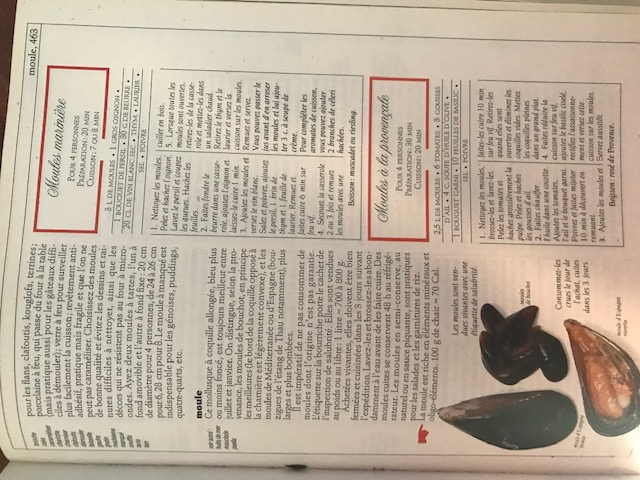
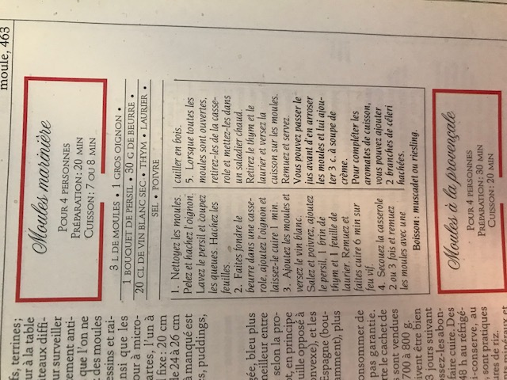

### Ingrédients

```
3 L de moules (3-4 kg)
1 gros oignon
1 bouquet de persil
30 g de beurre
200 mL de vin blanc sec
Thym
Laurier
Sel
Poivre
```

### Étapes de préparation

* Nettoyez les moules. Pelez et hachez l'oignon. Lavez le peril et coupez les queues. Hacgez les feuilles.

* Faite fondre le beurre dans une casserol, ajouter l'oignon et laissez-le cuire 1 minute. 

* Ajouter les moules et versez le vin blanc. Salez et poivrez, ajouter le persil 1 brin de thym et 1 feuille de laurier. Remuez et faites cuire 6 minutes sur feu vif.

* Secouer la casserole 2 ou 3 fois et remuez les moules avec une cuiller en bois.

* Lorsque toute les moules sont ouvertes, retirez-les de la casserole et mettez-les dans un saladier chaud. Retirez le thym et le laurier et versez la cuisson sur les moules. Remuez et servez.

#### Astuces
Vous pouvez passer le jus avant d'en arroser les moules et lui ajouter 3 c.à soupe de crème.

Pour completer les aromates de cuisson, vous pouvez ajouter 2 branches de céleri hachées. 


__Boisson__

Muscade ou riesling


### Image


