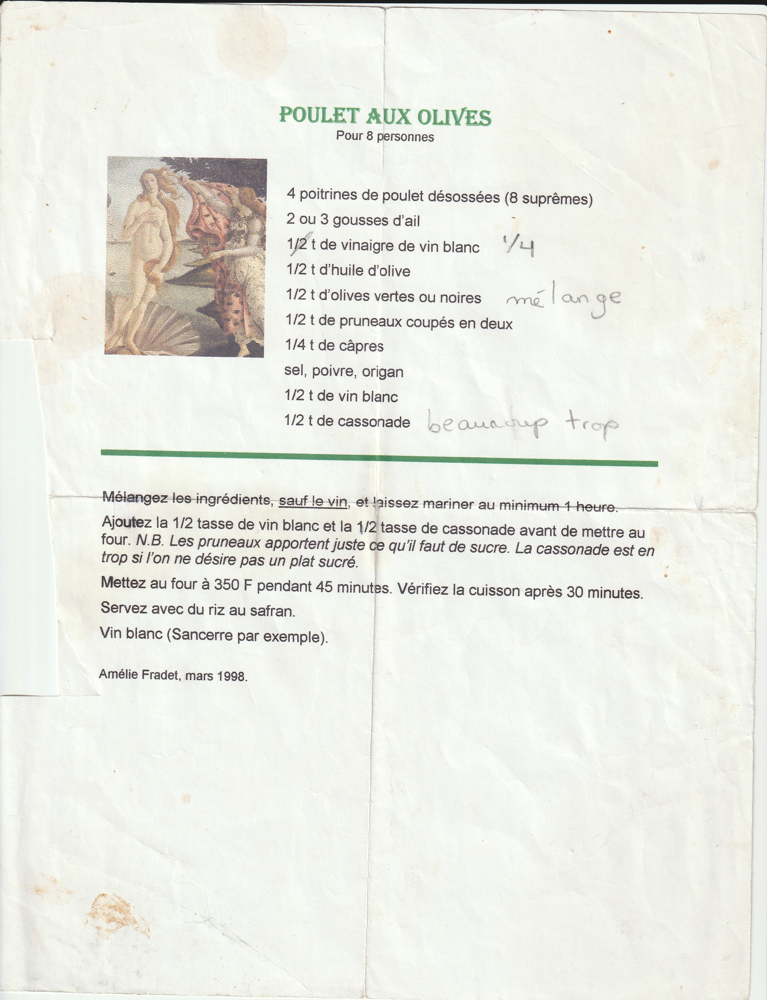

### Ingrédients

```
12 hauts de cuisse desosés
2 ou 3 gousses d’ail
1/4 tasse de vinaigre de vin blanc
1/2 tasse d’huile d’olive
1 tasse d’olives vertes ou noires (melange)
1 tasse de pruneaux coupés en deux
1/4 tasse de câpres
1/2 tasse de vin blanc
1/2 tasse de cassonade (beaucoup trop)
sel, poivre, origan
```

### Étapes de préparation
* Mélanger les ingrédients, sauf le vin, et laissez mariner au minimum 1 heure.

* Ajoutez la 1/2 tasse de vin blanc et la 1/2 tasse de cassonade avant de mettre au
four. N.B. Les pruneaux apportent juste ce qu'il faut de sucre. La cassonade est en
trop si l’on ne désire pas un plat sucré.

* Mettez au four à 350 F pendant 45 minutes. Vérifiez la cuisson après 30 minutes.
Servez avec du riz au safran.


### Image

